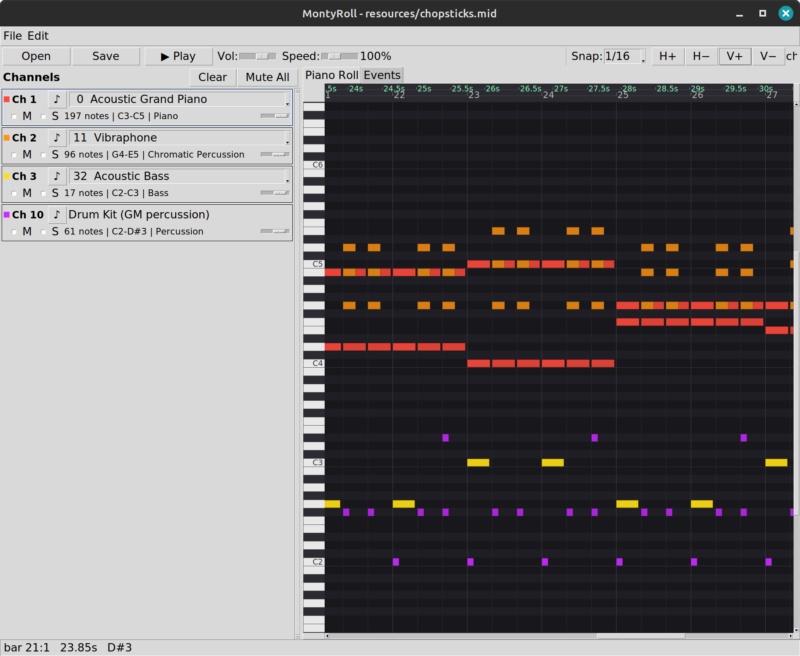
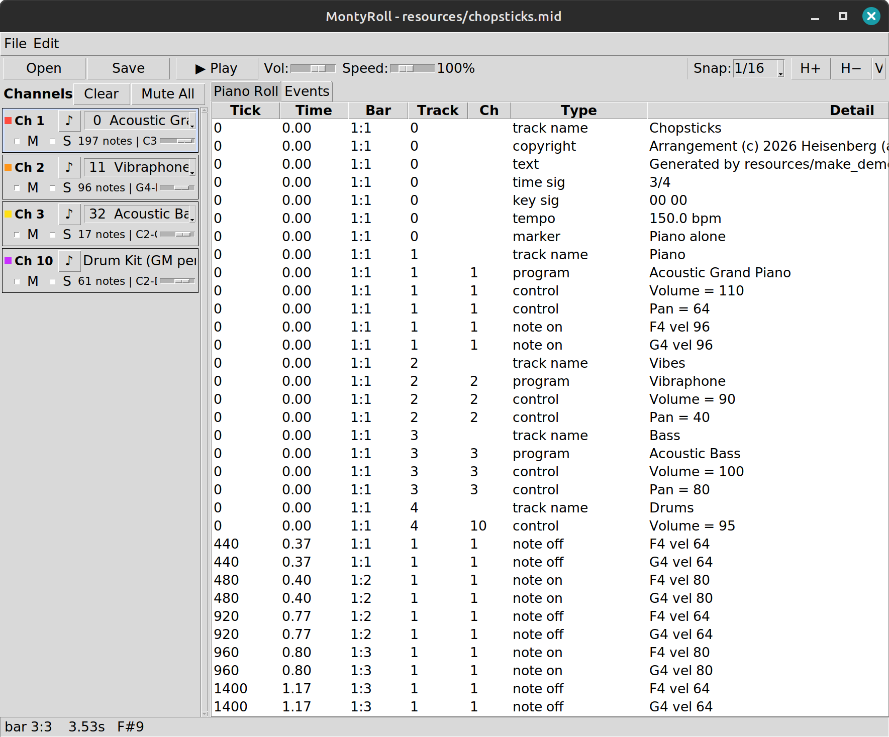

# MontyRoll

[](https://pypi.org/project/montyroll/)
[](https://pepy.tech/projects/montyroll)
[](https://www.python.org/)
[](LICENSE)
[](https://github.com/acscpt/montyroll/actions/workflows/tests.yml)
[](https://codecov.io/gh/acscpt/montyroll)

***And now for something completely MIDI***

MontyRoll is a lightweight and simple MIDI visualiser written in Python. It can read Standard MIDI Files and display the channels, their assigned instruments and a summary of what each one plays, and shows the notes on a scrollable, zoomable piano roll. It has no Python dependencies other than the standard library.

MontyRoll can also play the file through a [synth](#synths) such as `timidity`, if one is installed.

<a href="docs/images/note-display.png"></a> <a href="docs/images/events.png"></a>

## Requirements

- Python 3.10+ with tkinter (`sudo apt install python3-tk` on Debian/Ubuntu)

- Optional, for sound: a software synth on `PATH`, `timidity` recommended. See [Synths](#synths) for the alternatives and install commands.

Without a synth, everything except audio playback still works.

## Run

```bash
python -m montyroll                            # start empty
python -m montyroll path/to/file.mid
python -m montyroll resources/chopsticks.mid   # the bundled demo
```

The demo is an original arrangement of Chopsticks (Euphemia Allen, 1877, public domain) generated by `resources/make_demo.py`: piano alone for sixteen bars, then the repeat with vibes, bass and drums, a tempo lift at the repeat and a ritardando at the end.

## Features

**Visualisation**

- Channel strip for every channel in use:
  - colour key
  - GM instrument
  - note count
  - pitch range
  - instrument family
  - whether the part uses pitch bend

- Piano roll with:
  - per-channel colours
  - velocity-shaded notes
  - piano-key gutter
  - bar/beat grid

- Four-row header ruler:
  - seconds (tempo-aware)
  - bar numbers
  - tempo changes and markers from the file
  - the chord named in each beat, merged into runs

- A file can contain any number of tempo changes. Each one is shown in the header ruler, and the seconds row stretches and compresses against the bar grid to match.

- Event list with every message decoded, with tick, seconds and bar:beat for each

- Status bar tracking the pointer in musical time, naming the chord and the note (or drum sound) under the cursor

- A Report tab: the file's analysis as text, including how many instruments play at once and which pairs of channels rarely coincide, with a Save button; a second sub-tab reports on the reduced song while the reduction is on

- Key estimation for the whole file, shown in the toolbar summary

- Voice-demand strip under the roll: how many notes sound at once, stacked per channel in the roll's colours, with the count of distinct pitches (unisons merged) and of distinct pitch classes (octaves merged too) drawn over the stack, and a red line at a voice budget of your choosing. Pointing at it reports the counts and the busiest channels; each channel card shows its own peak, mean and share of the piece

**Editor**

- Add, move, resize and delete notes with the mouse (see [Controls](#controls)).

- Grid snap from whole notes down to 1/32, or off for free placement

- Set velocity on any selection.

- Change a channel's GM instrument and set the channel volume.

- Set the tempo from any bar (double-click the ruler's tempo row, or Edit > Set Tempo at Bar), remove a tempo change (right-click it), or scale every tempo in the file by a percentage. Tempo changes show as dashed lines down the roll.

- Saving re-serialises the original tracks, so any event the editor does not understand is written back unchanged.

**Reduce**

- Reduce the song to the voice budget set on the demand strip: every note scored by what is lost without it (priority, velocity, whether it is the top or bass of its part, whether it doubles another part), and when the budget is full the weakest note playing gives way.

- Per-pool transforms before any stealing: merge unisons (on by default), fold octave doublings, continue tremolo re-strikes within a gap, legato to the next onset within a gap, keep only the top line, thin chords to a number of notes.

- A priority per channel on its card, to keep one part at the expense of others.

- The roll shows the result with dropped and cut notes stippled, the strip shows the reduced demand, the panel reports what was kept, cut and lost, and Play auditions the reduced song. The file on disk is never changed; Save Reduced As writes the result to a new file.

**Listen**

- Play and stop from the toolbar or `Space`, with a cursor that follows the file's tempo map and auto-scrolls the roll.

- Mute and solo per channel. Mute silences a channel; solo plays only the soloed channels.

- Each channel's instrument can be previewed from the channel strip, in that channel's own pitch range.

- Master volume and playback speed (25-300%), affecting playback only

- Mute, solo, volume and speed all take effect during playback, which carries on from the cursor position.

- Live readout of elapsed time, bar:beat and current tempo

## Controls

| Action | Control |
| --- | --- |
| Play / stop | `Space` or the toolbar button |
| Select all / clear | `Ctrl+A` / `Esc` |
| Delete selection | `Del` |
| Open / save | `Ctrl+O` / `Ctrl+S` |
| New file | `Ctrl+N` |
| Add a note | Double-click the piano roll |
| Move / resize a note | Drag the note / drag its right edge |
| Zoom horizontally | `Ctrl` + mouse wheel (anchored at the pointer) |
| Scroll horizontally | `Shift` + mouse wheel |
| Scroll vertically | Mouse wheel |
| Note context menu | Right-click |
| Set tempo from a bar | Double-click the ruler's tempo row |
| Tempo menu (set, remove, scale all) | Right-click the ruler's tempo row |

## Synths

MontyRoll makes no sound of its own. For playback it writes a temporary MIDI file and hands it to the first of these found on `PATH`:

- [TiMidity++](https://timidity.sourceforge.net/) (`timidity`), recommended. On Debian/Ubuntu: `sudo apt install timidity`.

- [FluidSynth](https://www.fluidsynth.org/) (`fluidsynth`), which needs a General MIDI soundfont in `/usr/share/sounds/sf2`, `/usr/share/soundfonts` or `/usr/local/share/soundfonts`. On Debian/Ubuntu: `sudo apt install fluidsynth fluid-soundfont-gm`.

- [WildMIDI](https://github.com/Mindwerks/wildmidi) (`wildmidi`)

- `aplaymidi` from [alsa-utils](https://github.com/alsa-project/alsa-utils), used only when an ALSA synth port other than "Midi Through" exists. Midi Through is always present and plays nothing, so on its own it is not enough.

## Licence

MIT - see [LICENSE](LICENSE).
